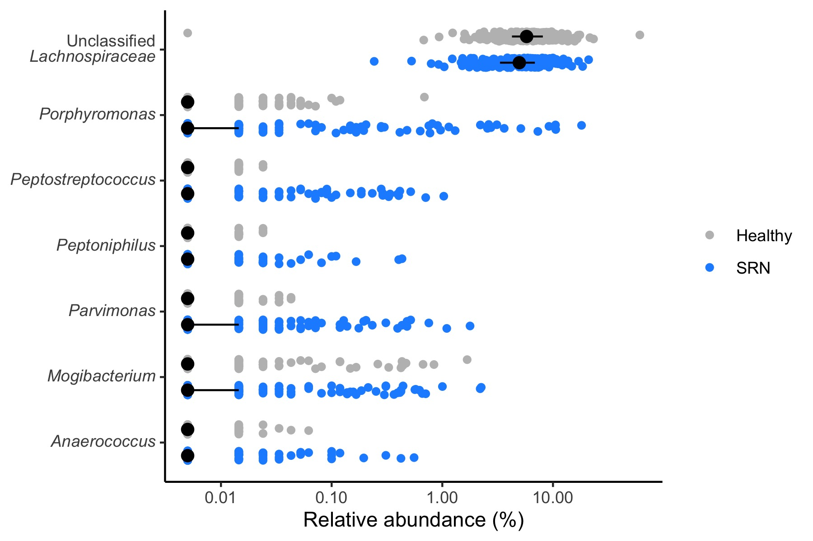

# Machine_Learning_Project

Fun times! I'll be following along the Riffomonas Project to try out their Machine Learning R package. Along the way I will also:
*  Try using git in R
*  Try out mikropml : a supervised machine learning pipeline

Test
The code here, and data comes Pat Schloss Code Club at [Riffomonas](https://riffomonas.org/)
Here I coded alongside the videos, and made notes in my code so my code will not look exactly like his.

I would recommend the tutorial. I found it useful to code alongside someone with more experience in R then me. It's helpful to see how someone else does things. 

Videos 1-3 are setting up background steps for ML, if you want to go there ASAP skip ahead

## Video 1: Data Cleaning 

Highlights: str_replace_all is handy tool with regex to change formating of things, also using tidyverse more for datacleaning, which I do sometimes but %>% is more efficient than what I do, so I should use it more often!
see R script code/genus_analysis.R

We started with the OTU abundance table

```
raw_data-0.3/baxter.subsample.shared
```
Merged it with the taxonomy information

```
raw_data-0.3/baxter.cons.taxonomy
```
Also with the metadata
```
raw_data-0.3/baxter.metadata.tsv
```
I output the composite of this into /processed_data 

## Video 2: Testing for significance

  * nest() : Cool command useful for selecting a column of data from data table for analysis, then bringing it back after. Need to look into more. Seems useful
  * tidy() : Part of broom package used to pipe results 
  * using Terminal tab in a R project
  
Here we looked at which genus were significantly different in patients with SRN using a Wilcox test, then made a ggplot of the 7 significantly altered genus


##Video 3: Using custom R functions 
