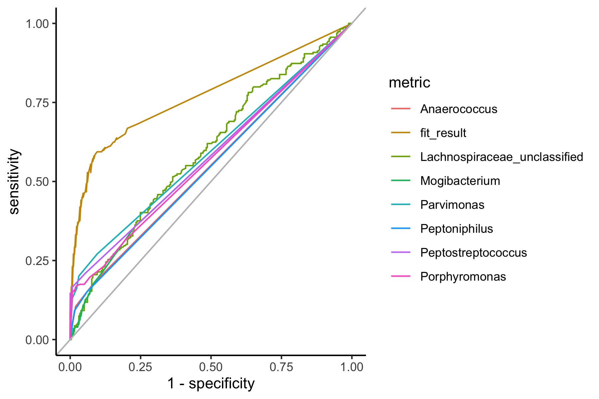
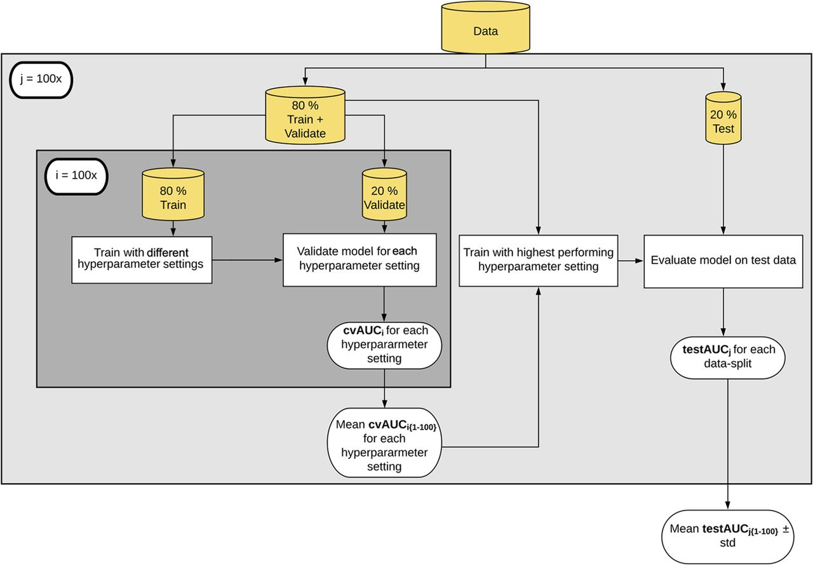

# Machine_Learning_Project

In microbiome data we're always trying to look how complex communities change. It's standard practice now to use machine learning to answer the question, so I thought it'd be a good place to see it in action, and how it compares to other statistical methods I am more familiar with. For me the real advantage is using a dataset I'm familiar with.

Data is from Dr. Pat Schloss, it is a colorectal cancer project.

Fun times! I'll be following along the Riffomonas Project to try out their Machine Learning R package. The bonus for me is:
*  Try using git in R (I have only used it from command-line up until now)
*  Try out mikropml: a supervised machine learning pipeline (Built around DOI: https://doi.org/10.1128/mBio.00434-20)

The code here, and data comes Pat Schloss Code Club at [Riffomonas](https://riffomonas.org/)
Here I coded alongside the videos, and made notes in my code so my code will not look exactly like his.

I would recommend the tutorial. It is always useful to code alongside someone with more experience in R then me. See how someone else does things. 

Video 1 is simply setting up a git account and repo. So I am skipping it.
Videos 2-3 are setting up background steps for ML, if you want to go there ASAP skip ahead

## Video 2: Data Cleaning 

Highlights: str_replace_all is handy tool with regex to change formating of things, also using tidyverse more for datacleaning, which I do sometimes but %>% is more efficient than what I do, so I should use it more often!
see R script code/genus_analysis.R

We started with the OTU abundance table

```
raw_data-0.3/baxter.subsample.shared
```
Merged it with the taxonomy information

```
raw_data-0.3/baxter.cons.taxonomy
```
Also with the metadata
```
raw_data-0.3/baxter.metadata.tsv
```
I output the composite of this into /processed_data 

## Video 3: Testing for significance for specific bacteria CC122

We're going to look for which genera of bacteria are significantly different (abundance) in SCN. We've got two groups (True/False on SRN) Wilcoxin Test

  * nest() : Cool command useful for selecting a column of data from data table for analysis, then bringing it back after. Need to look into more. Seems useful
  * tidy() : Part of broom package used to pipe results 
  * using Terminal tab in a R project
  
Here we looked at which genus were significantly different in patients with SRN using a Wilcox test, then made a ggplot of the 7 significantly altered genus


Other things I learned in-directly was about hidden objects in R (prefix with dot notation) which makes sense after I googled it (for example hidden files often start with .)

##Video 4: ROC curve for inividual biomarkers CC123

Why we need to used more advanced modeling in microbiome datasets as we see in the significance results from Video 3, while some specific genus might be more abundant in individuals with a disease, most of the individuals in the study will still not have this particular genus. So the idea that one bacteria might cause a disease is unlikely (see Koch's posutlates).

Looking at FIT test: Fecal Immunochemical Test connecting to microbiome data.

Building a ROC curve using FIT and SRN compared to other data.
Riffomnas has more in depth video on ROC curve [Riffomonas](https://www.youtube.com/watch?v=XSRO4VKD-pc)

We see nicely that while FIT test, which is used for diagnostic of SRN does perform relatively well each bacteria alone does not act as a good biomarker for predicting SRN



## Video 5: Introduction to Supervised Machine Learning Pipeline CC124
mikropml: a supervised machine learning
Note: runs carrot

We began by looking at whether in our 490 samples (individuals) our 280 bacteria (at the genus level) shift their relative abundance in patients with SRN.

The mikropml pipeline

Figure taken from [Topçuoğlu et al. (2020)](https://doi.org/10.1128/mBio.00434-20)

We first used logistic regression: 

A) Logistic regression B) The 80/20 split where the 5 fold cross validation occurs C) Lambda parameter is the hyperparameter (between 10^-4 and 10) to maximize the AUC D) the tuning parameter was held constant

```{r}
$performance
# A tibble: 1 × 17
  cv_metric_AUC logLoss   AUC prAUC Accuracy Kappa    F1 Sensitivity Specificity Pos_Pred_Value Neg_Pred_Value Precision Recall Detection_Rate Balanced_Accuracy
          <dbl>   <dbl> <dbl> <dbl>    <dbl> <dbl> <dbl>       <dbl>       <dbl>          <dbl>          <dbl>     <dbl>  <dbl>          <dbl>             <dbl>
1         0.636   0.674 0.714 0.699    0.588 0.121 0.718       0.981       0.133          0.567          0.857     0.567  0.981          0.526             0.557
# … with 2 more variables: method <chr>, seed <dbl>

$feature_importance
[1] "Skipped feature importance"
```
We skipped feature importance as we are still trying to work things out.

## Video 6: Preprocessing data & Building Machine Learning Models in R CC125

Here we look at the benefits of preprocessing data before, to avoid having thousands of features in the data. Preprocessing is an important step but can't easily be done with tool default settings.

mikropml can be used to preprocess data, and we'll see how this package does it. 

Step 1, is to remove features. Which for example in microbiome studies could be metadata like patient age, sex, a genus of bacteria, etc. Features with no variation or with lots of absences in data. Or also turn categorical data into something we can run machine learning on.

First we explored preprocessing SRN against the features fit_result, site, gender, and weight using the mikropml command preprocess_data()

We see how it's beneficial to remove features with no variation, or columns that are perfectly coorelated with each other.

```{r}
preprocess_data(srn_genus_data, outcome_colname = "srn")$dat_transformed -> preprocessed_genus_data
#Removes 180 genus that are non-essential
run_ml(preprocessed_genus_data,
       method="glmnet",
       outcome_colname = "srn", #What it is trying to predict
       seed = 19760620, #number of iterations
       kfold = 5, #Default 5 fold cross validation
       cv_times = 100, #Default
       training_frac = 0.8) #Default

trained_model
glmnet 

393 samples
100 predictors
  2 classes: 'healthy', 'srn' 

No pre-processing
Resampling: Cross-Validated (5 fold, repeated 1 times) 
Summary of sample sizes: 314, 315, 314, 314, 315, 314, ... 
Resampling results across tuning parameters:

  lambda  logLoss    AUC        prAUC      Accuracy   Kappa       F1         Sensitivity  Specificity  Pos_Pred_Value  Neg_Pred_Value  Precision  Recall   
  1e-04   1.0075322  0.5859021  0.5765245  0.5658986  0.12405685  0.6046973  0.6278676    0.49553453   0.5859823       0.5414633       0.5859823  0.6278676
  1e-03   1.0075322  0.5859021  0.5765245  0.5658986  0.12405685  0.6046973  0.6278676    0.49553453   0.5859823       0.5414633       0.5859823  0.6278676
  1e-02   0.9988228  0.5861784  0.5767422  0.5663829  0.12499952  0.6052527  0.6286365    0.49569670   0.5863379       0.5420957       0.5863379  0.6286365
  1e-01   0.7548531  0.6008657  0.5858484  0.5862244  0.16072233  0.6367207  0.6850523    0.47401051   0.5969652       0.5724084       0.5969652  0.6850523
  1e+00   0.6744457  0.6142330  0.5939517  0.6055597  0.18477634  0.6927596  0.8381127    0.34146847   0.5914975       0.6572171       0.5914975  0.8381127
  1e+01   0.6860863  0.6141917  0.5939553  0.5493202  0.04002808  0.7018271  0.9970360    0.04077628   0.5415682       0.9240957       0.5415682  0.9970360
  Detection_Rate  Balanced_Accuracy
  0.3339128       0.5617011        
  0.3339128       0.5617011        
  0.3343207       0.5621666        
  0.3643166       0.5795314        
  0.4456974       0.5897906        
  0.5302313       0.5189061        

Tuning parameter 'alpha' was held constant at a value of 0
AUC was used to select the optimal model using the largest value.
The final values used for the model were alpha = 0 and lambda = 1.

preprocess_data_results$performance
# A tibble: 1 × 17
  cv_metric_AUC logLoss   AUC prAUC Accuracy Kappa    F1 Sensitivity Specificity Pos_Pred_Value Neg_Pred_Value Precision Recall Detection_Rate Balanced_Accuracy
          <dbl>   <dbl> <dbl> <dbl>    <dbl> <dbl> <dbl>       <dbl>       <dbl>          <dbl>          <dbl>     <dbl>  <dbl>          <dbl>             <dbl>
1         0.614   0.653 0.680 0.659    0.619 0.208 0.704       0.846       0.356          0.603          0.667     0.603  0.846          0.454             0.601
# … with 2 more variables: method <chr>, seed <dbl>
```
Only a small difference in performance, but runs faster.